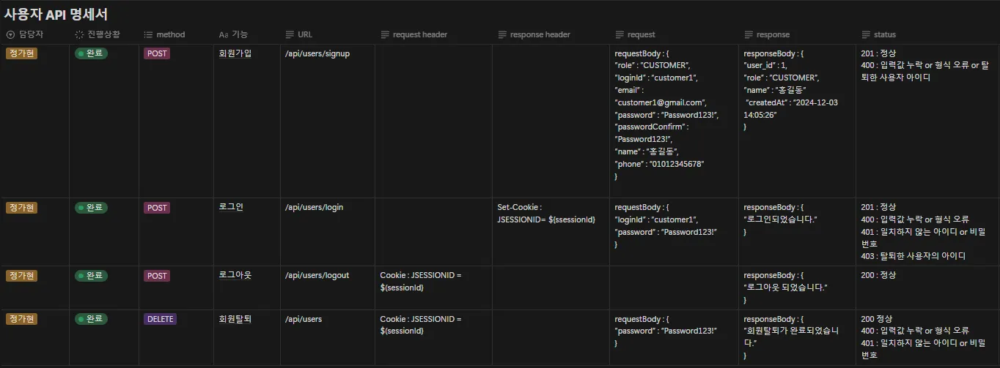
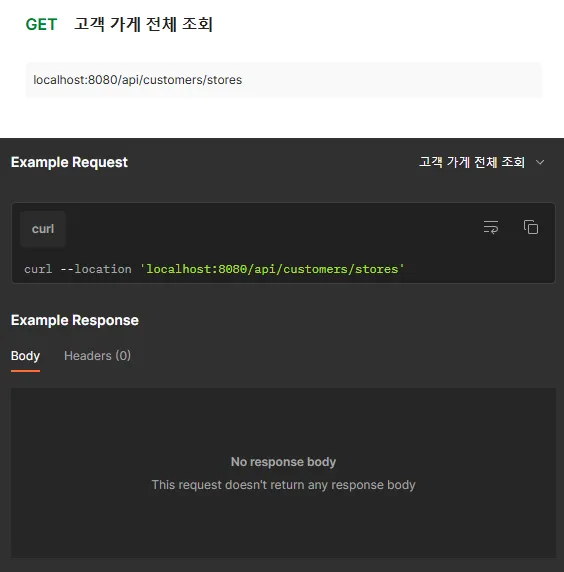
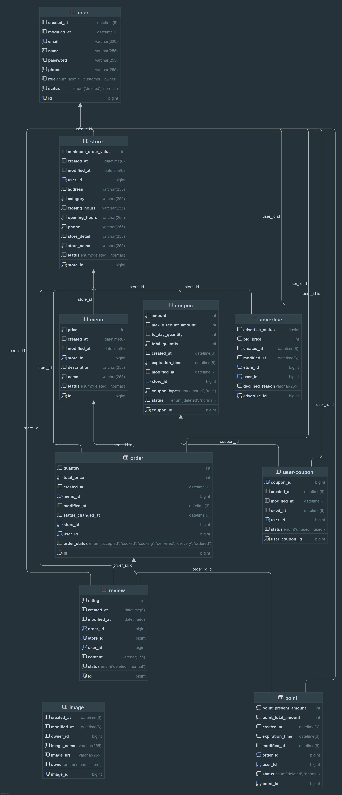

# **Hexa Code Delivery Project**

---
## 프로젝트 소개

---

**기본적인 주문 기능은 물론, 쿠폰 및 포인트 등 소비자의 니즈를 반영한  최고의 배달서비스**

---

## 프로젝트의 목적 및 목표

---

저희 프로젝트의 목적은,

보통 다양한 색상들을 정의할 때 사용하는  HexaCode라는 이름에 걸맞게 다양한 소비자들, 가게 사장님, 
그리고 관리자의 니즈까지 모두 맞춰 줄 수 있는 배달 서비스를 만드는 것이 목적이었습니다.

이를 위한 목표로,

유지보수가 용이하고, 코드관리가 쉽도록하기 위해서, 시스템을 도메인으로 분리하여 설계를 하였고, Enum을 활용하였으며, 
전역 코드들은 Global로 따로 묶어 관리하도록 설계를 하였습니다.

---

## 팀 소개

---

| **이름** | 역할 | 블로그 주소 |
| --- | --- | --- |
| 김동건 | 팀장 | [https://codinggeony.tistory.com/](https://github.com/gimdonggeon) |
| 김세원 | 팀원 | https://velog.io/@take_the_king/posts |
| 이창현 | 팀원 | https://velog.io/@dirtbags/posts |
| 정가현 | 팀원 | https://velog.io/@dg6080/posts |

---

## 담당 과업

---

### 공통 과업

- API, ERD 기획 및 설계
- Github PR 코드 검토 및 승인/반려
- 와이어 프레임 설계
- Postman을 통한 구현 기능 검증
- 전체 기능 POSTMAN Test 후 담당 기능 오류 수정

### 김동건

- Order관련 로직 구현
- 전체 코드 POSTMAN test 시연 작업
- README 작성

### 김세원

- Menu 관련 로직 구현
- GlobalExceptionHandler 구현
- Point & Coupon 관련 로직 구현
- Image 관련 로직 구현
- Shopping-basket 관련 로직 구현
- Trouble-Shooting 작성
- 시연 영상 촬영

### 이창현

- Store 관련 로직 구현
- Admin 관련 로직 구현
- Advertise 관련 로직 구현
- Order 강화 관련 로직 구현
- 프로젝트 발표

### 정가현

- 인증 / 인가 관련 처리
- 로그인 인터셉터 관련 로직 구현
- User 관련 로직 구현
- Review관련 로직 구현
- 프로젝트 PPT 제작

## 개발 환경

---

JAVA : JDK 17

Spring Boot : 3.3.5

IDE : IntelliJ

MySQL : Version 8+

---

---

## 기능

---

### 공통 기능

- BCrypt를 통한 비밀번호 암호화
- /S3Client 설정을 통한 AWS S3통신할 수 있는 클라이언트를 생성하여, AwsBasicCredentials.create( )를 사용하여 
AWS인증 정보를 받아와서 S3Client.builder( )로 S3 클라이언트를 빌드하도록 함
- /api/** 경로에 로그인 인터셉터를 적용하여, 권한 별 인터셉터에 따라 권한을 가진 사용자만 보호하도록 기능 구현
- BusinessException 상속을 통한 각기 다른 비즈니스 로직 예외 처리
- ExceptionType에 의해 정의된 상태 코드와 메시지를 통한 일관된 예외 처리 체계 제공
- GlobalExceptionHandler를 통한 애플리케이션 예외의 전역적 처리 가능

### User

- 회원가입, 로그인, 로그아웃, 회원탈퇴 기능 구현

### Order

- 관리자가 배달 어플리케이션 주문 통계조회(일간 및 월간 주문 수와 일간 및 월간 주문 금액 조회)
- 고객이 주문 생성, 조회, 포인트 자동 적립, 사용, 조회 기능 구현
- 사장이 주문 조회, 주문 거절, 상태 변경, 포인트 생성, 유효시간 만료 시 자동 삭제 기능 구현

### Coupon

- 고객이 자신의 쿠폰 정보 조회, 가게 쿠폰 조회, 쿠폰 발급 기능 구현
- 가게 사장이  자신의 가게의 쿠폰 생성, 조회, 쿠폰 상태 변경 기능 구현

### Image

- 이미지 업로드, 조회, 수정, 삭제 기능 구현

### Menu

- 고객이 메뉴 조회 기능 구현
- 가게 사장이 메뉴 CRUD 할 수 있는 기능 구현

### Review

- 주문한 고객의 리뷰 생성, 전체 조회, 나의 리뷰 조회 기능 구현
- 가게 사장이 리뷰 조회 기능(리뷰의 최소 및 최대 별점 기준으로 필터링 가능)

### Admin

- 관리자의 주문 통계(일간 및 월간 주문 수와 일간 및 월간 주문 금액) 조회 기능 구현

### Advertise

- 가게 주인이 관리자에게 자신의 가게 광고 요청 기능 및 요청된 광고 상태 조회 기능 구현
- 관리자가 사장의 광고 신청에 대한 승인/거절 기능 구현

### ShoppingBasket

- 장바구니 CRUD 기능

### Store 기능

- 고객이 가게 전체 및 단건 조회 기능
- 카테고리 및 검색 조건에 맞게 데이터 처리 기능

---

## 특징

---

### 공통기능

- Status Enum 클래스를 전역 클래스로 구현하여,  Normal, DELETE Enum을 통한  일관된 논리적 삭제 구현

### Point & Coupon

- 유효기간이 지난 쿠폰 및 포인트를 자동으로 삭제할 수 있도록 적용
- 사용 시 여러 포인트를 순차적으로 사용하며, 결제 시 남은 포인트를 먼저 적용하고, 남은 값은 결제를 할 수 있도록 구현
- 쿠폰 발급 시 유효성 검사를 철저히 처리(만료된 쿠폰, 수량 부족 등)

### Image

- ImageRepository를 통해 이미지 정보를 데이터 베이스에 저장 및 관리
- UUID 사용을 통한 이미지 파일이름을 고유 생성하여, S3에 저장된 이미지 URL 제공

### ShoppingBasket

- 실제 장바구니에 대한 처리를하고, 쿠키를 사용하여 장바구니 상태를 저장
- 사용자가 장바구니를 추가하거나 수정할 때 쿠키를 갱신하고 이를 HttpServletResponse에 반영하도록 구현

---

## 와이어프레임

- MIRO 화면

  https://miro.com/app/board/uXjVL8tj7uE=/

---

## **API  명세서**

### 팀 노션 URL : [https://www.notion.so/teamsparta/6-HexaCode-1492dc3ef51481268962c1a4160b1cbd](https://www.notion.so/1492dc3ef51481268962c1a4160b1cbd?pvs=21)

### 팀 노션 API 명세서 예시

### API Request & Response URL : https://documenter.getpostman.com/view/39379207/2sAYBd6SrL

### API Request & Response 예시

---

## **ERD**

### ERD 구성

---

## Trouble-Shooting

---

1. 스프링 Scheduled 사용법 : https://velog.io/@take_the_king/%EC%8A%A4%ED%94%84%EB%A7%81-Scheduled-%EC%82%AC%EC%9A%A9%ED%95%98%EB%8A%94-%EB%B2%95

2. JPA 다대다 관계 해결 방법 :
   https://velog.io/@take_the_king/JPA-%EB%8B%A4%EB%8C%80%EB%8B%A4-%EA%B4%80%EA%B3%84-%ED%95%B4%EA%B2%B0

3. 쿠키에 객체를 저장하는 방법 : https://velog.io/@take_the_king/%EC%BF%A0%ED%82%A4%EC%97%90-%EA%B0%9D%EC%B2%B4%EB%A5%BC-%EC%A0%80%EC%9E%A5%ED%95%98%EB%8A%94-%EB%B2%95

---

## 마무리하며

---

### 개선할 점

- 초기 설계의 중요성 : 초기 설계 단계에서 필수만 생각하고 설계를 하다보니, 이후 도전과제를 하면서, 수정해야 하는 필드나 테이블들이 생기는 등 문제가 발생했습니다. 
그래서 이후 프로젝트 때는 초기 설계 시에조금 더 꼼꼼히 설계를 해서 중복 작업을 없애도록 해 보겠습니다.
- 카테고리 분류의 기준 정립 : 예를들어, Enum이라는 카테고리를 도메인 외에 따로 분리해서 작업을 했는데, 튜터님들께서 보시고, Enum클래스가 전역적으로 쓰이는 것이라면 따로 분리하는 것이 맞지만, 
그렇지 않으면, 사용되는 도메인 안에 Enum을 넣는 것이 낫다고 하셔서 카테고리를 다시 정리하는 등의 카테고리 리팩터링이 종종 발생하여, 카테고리 분류 쪽을 조금 더 공부하고 팀원들과의 소통을 통해 
이후에는 카테고리를 분류 할 때 기준을 정립할 수 있도록 하겠습니다.

### 프로젝트 마무리 소감

김동건 : 이번 프로젝트는 개인적으로 너무 어려웠습니다. 사실, 팀원들이 없었다면, 저 혼자서는 아무것도 제출하지 못 할 정도의 프로젝트라고 여겨져서, 진짜 더 많이 공부해야겠다고 생각했고, 
혼자서라도 뭐라도 조금씩 만들어보고, 1:N, N:N, N:1  관계도 계속 생각하고 만들어 봐야겠다고 느꼈습니다. HexaCode팀 고생 많으셨습니다.

김세원 : 이번 프로젝트는 실제로 큰 프로젝트를 아웃소싱 받아서 수행하는 느낌을 받아서 촉박하면서도 재밌는 시간이었습니다!